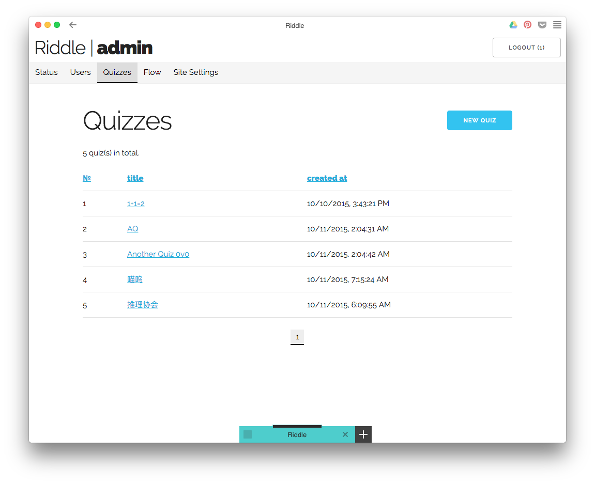
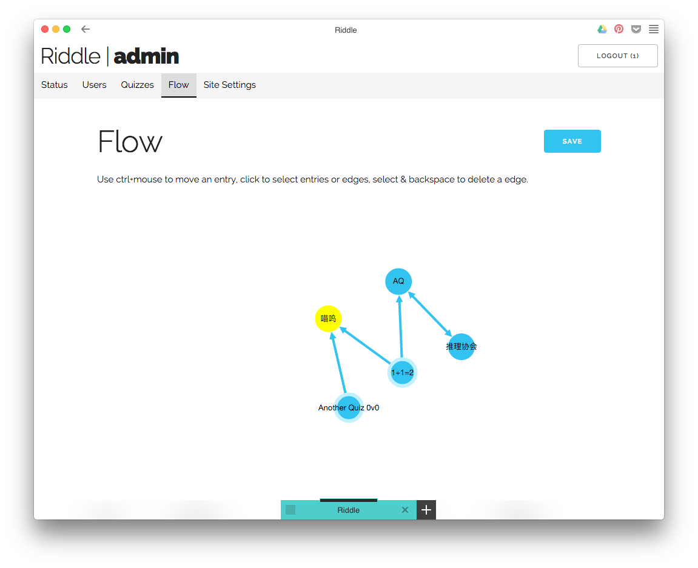

# riddle

v0.1.0 :construction:

A application for series of puzzle challenge, like [Python Challenge](http://www.pythonchallenge.com/)

Users & groups & problems management, quizzes orders, real-time submissions, designed to simple and responsive.

## Install
- `git clone git@github.com:quietshu/riddle.git`
- `npm install`

Modify your settings in `config.json`, change the default HTTP port in `bin/www` line 15.

## Usage
- Make sure MongoDB is running
- `npm start`

Currently you must modify the `group` field from `user` to `admin` of all administrators in DB to make it work.

## Screenshots

